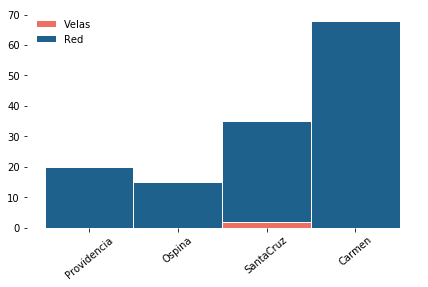

<h1 id="contexto" class="unnumbered unnumbered">Contexto</h1>
<p>El objetivo del presente proyecto es analizar el acceso a energía de una muestra de clientes de la 
institución de microfinanzas <strong>Fondesurco</strong> a través del uso de la herramienta HEDERA 
collect con el fin de extraer información relevante sobre el uso, costos asociados y atributos del 
acceso a electricidad y soluciones de cocina de clientes de Fondesurco en zonas rurales y remotas. 
Con este fin, por medio del uso de la aplicación de la herramienta de HEDERA se recogió una línea base
del Objetivo de Desarrollo Sostenible 7, elaborando un primer diagnóstico del acceso a energía siguiendo
los estándares de métricas internacionales, la metodología del “Enfoque Multinivel (Multi-Tier Framework 
(MTF))” desarrollado por el Banco Mundial y del Índice de Progreso fuera de la Pobreza Energética 
(Progress out of Energy Poverty Index (PEPI)) <a href="https://depositonce.tu-berlin.de/handle/11303/6708">[N. Realpe, PhD Thesis 2017]</a>.</p>

<p><span>La herramienta <strong>HEDERA collect</strong> es una aplicación móvil diseñada para captar la información más 
relevante sobre acceso a servicios básicos a nivel de hogar para medir y monitorear los Objetivos de Desarrollo Sostenible.</span><br /></p>


<h1 id="metodología" class="unnumbered unnumbered">Metodología</h1>
<p>Previo al levantamiento de datos todos los involucrados fueron informados y entrenados sobre el uso de las herramientas. 
Los Analistas recibieron un video GIF a sus teléfonos celulares con el procedimiento de uso del la herramienta HederaGPS y el 
Operador fue entrenado durante de una videollamada haciendo uso presencial de la herramienta HederaSDG7.</p>
<p>El levantamiento de información fue realizado en 2 etapas:</p>
<p>Durante la primera etapa se realizó una visita domiciliaria haciendo uso de la herramienta HederaGPS para el proceso de evaluación 
de crédito. A su vez, durante esta visita se hizo la entrega al cliente de un folleto con la información general del contenido de la 
encuesta. También se comunicó al cliente sobre la llamada de un &quot;Operador&quot; para realizar la encuesta digital.</p>
<p>Durante la segunda etapa se ha hecho uso de los datos recoletos durante la primera etapa. Estos datos se han puesto a disposición 
de área de IDI de Fondesurco (Flor Villena Sosa) para que el Operador identificara y contactara vía telefónica a los clientes que hayan 
realizado un desembolso. Durante la llamada telefónica el Operador utilizó la herramienta HederaSDG7. El tamaño de muestra correspondió 
al número de clientes que hayan realizado una operación de desembolso durante el proyecto.</p>


<h4 id="instalación-de-la-herramienta">Instalación de la Herramienta</h4>
<p>La herramienta se compone de dos compontes independientes y complementarias.</p>
<ul>
<li><p><strong>HederaGPS</strong>, para la recolección y el procesamiento de los datos relacionados a la geolocalización y los números 
DNI de los entrevistados.</p></li>
<li><p><strong>HederaSDG7</strong> para el levantamiento de información de acceso a energía basado en la métrica del Banco Mundial 
Multi-Tier Framework (MTF) por medio de una encuesta digital.</p></li>
</ul>


<h4 id="recolección-de-datos-gps-analista">Recolección de datos GPS (Analista)</h4>

<h4 id="cuestionario-de-acceso-a-energía-operador">Cuestionario de acceso a energía (Operador)</h4>
<p>El Operador cumplía la función de contactar a los clientes que hubiesen realizado un desembolso. La manera de realizar el 
contacto fue por teléfono haciendo uso de la herramienta HederaSDG7 para registrar las preguntas. A su vez el Operador proporcionará 
retroalimentación respecto a mejoras y sugerencias frente al uso de la herramienta.</p>


<p>
    <table>
        <tbody>
            <tr>
                <td> number of survey per day + number of non answered per day </td>
                <td> Time per interview (average per day) </td>
            </tr>
            <tr>
                <td>  </td>
                <td>  </td>
            </tr>
        </tbody>
    </table>
</p>   


<h1 id="resultados">Resultados</h1>
<p>Durante el proyecto hubo 229 desembolsos realizados en las agencias seleccionadas para el proyecto.</p>
<p>De este total corresponden:</p>
<p>130 personas que contestaron el celular y respondieron la encuesta. 19 personas que contestaron el celular y no respondieron la encuesta. 23 personas que no contestaron el celular (timbra, pero nadie contesta). 46 personas con las cuales no fue posible tener una conexión debido a tenían el celular apagado o aparentemente no tenían señal. A este grupo se le realizó llamadas en más de una ocasión tanto en la mañana como en la tarde.</p>
<p>11 números de teléfono que son incorrectos o el socio indicó que no era su celular y se mostró evasivo.</p>
<p>En el contexto anterior la muestra resultó ser de 130 personas (encuestas).</p>


<p>
    <table>
        <thead>
            <tr> 
                <td> Number of surveys per office </td>
                <td> Index of Access to Electricity (World Bank) </td>
                <td> Index of Access to Cooking Solutions (World Bank) </td>
            </tr>
            <tr> 
                <td> </td>
                <td>  </td>
                <td> </td>
            </tr>
        </thead>
    </table>
    

</p>


<h4 id="dificultades-y-soluciones">Dificultades y soluciones</h4>
<p>Durante el proyecto se presentaron los siguientes dificultados que fueron abordadas con las soluciones descritas a continuación:</p>
<p>Errores en el envío de datos utilizando HederaGPS Los Analistas fueron directamente asesorados por medio de WhatsApp para asegurar la 
calidad de los datos.</p>
<p>Errores en el envío de la geolocalización utilizando la herramienta HederaGPS Se preparó un video GIF para los Analistas mostrando el 
paso a paso para enviar la geolocalización para el envío de los datos vía WhatsApp.</p>
<p>Dificultades en la captura de la geolocalización con la aplicación WhatsApp Se preparó un video en YouTube explicando la forma correcta 
de enviar los datos vía WhatsApp en caso de no tener conexión a internet.</p>
<p>Los primeros registros de los datos utilizando la herramienta HederaSDG7 indicaban valores improbables de la duración de las encuestas 
vía telefónica Se realizaron ajustes en la programación de le herramienta para capturar el tiempo de las llamadas para lograr veracidad 
sobre los datos correspondientes a la duración de las encuestas</p>
<p>Durante las encuestas vía telefónica se identificaros preguntas que resultaban confusas para los clientes Se realizaron cambios al 
contenido de las encuestas y a programación de la estructura para mejorar el proceso de la encuesta.</p>

<h1 id="conclusión" class="unnumbered unnumbered">Conclusión</h1>
<p>Se implementó la herramienta Hedera Collect utilizando las herramientas HederaGPS y HederaSDG7 para el levantamiento de información 
de acceso a energía. El proyecto consistió en identificar y georreferenciar los datos recolectados con la herramienta, y en evaluar el 
uso de la herramienta para las actividades de recolección de datos tanto de acceso a electricidad como a soluciones de cocción. El 
proyecto se realizó a su vez con el propósito de generar información de mercado a Fondesurco y de proveer retroalimentación respecto 
a las herramientas, análisis y procesos a HEDERA.</p>
<p>El proyecto permitió realizar el procedimiento para obtener el desembolso de 229 clientes de los cuales 130 fueron registrados con 
la herramienta HederaSDG7.</p>
<p>El método de recolectar la geolocalización y el DNI, y de procesar los datos con le herramienta HederaGPS permitió asignarles el 
posicionamiento georreferenciado a los datos de los clientes entrevistados.</p>


<p> <br />
</p>

<p>Fondesurco es una cooperativa de ahorros y de crédito de la ciudad de Arequipa, Perú. Con más de 26 oficinas en el sur de Perú, 
localizados en los departamentos: Arequipa, Moquegua, Puno, Ayacucho y Huancavelica, Fondesurco tiene una visión de cooperativa 
    buscando consolidarse en las zonas rurales donde las posibilidades de acceso a crédito son escasas. Con una transformación 
    reciente de ONG a Cooperativa, Fondesurco aumentó la oferta de servicios financieros incluyendo el ahorro. Como institución 
    pionera en el país en el desarrollo de productos de crédito de microfinanzas verdes en el marco de su Programa de Soluciones 
    de Energía Renovable (SER), su objetivo es ofrecer un mejor acceso a las energías limpias a la población rural de bajos 
    recursos en sus zonas de cobertura.</p>
<p><br />
</p>
<p> <br />
</p>

<p>HEDERA es una Startup basada en Berlín que tiene por objetivo revolucionar la forma en que el impacto se mide, monitorea y 
reporta. HEDERA ofrece la plataforma para compartir y escalar actividades de inversión sostenible &amp; monitorear de manera 
costo-eficiente, descentralizada y centrada en el cliente el impacto con respecto a los alcances de los ODS. A través de sus 
herramientas móviles, HEDERA empodera a las instituciones a recoger información a bajo costo y visualizarla analizada y siguiendo
los estándares internacionales de medición de impacto. Además, a través de su red, HEDERA permite la conexión de actores en el
sector de inversión de impacto de una manera eficiente y económica.</p>

<div markdown="1" class="cell code_cell">
<div class="input_area hidecode" markdown="1">
```python
#HIDDEN
import os,sys

'''
This is an option to load the libraries directly from the HIT library.
However, the path shall be set correctly.
'''
# add the path to HIT
here = os.path.abspath('')
sys.path.insert(0, os.path.normpath(os.path.join(here, '../../Dasboard/src')))

# import HIT libraries
import hedera_types as hedera
import odk_interface as odk
import tiers as mtf

# create the demo institution
sunrise = hedera.mfi(1)
odk_data_dir = '../../Dasboard/_datasets/DataODK/'

odk_survey_folder = ['PEPI_19_03_19/','PEPI_FONDESURCO_19_04_17/']
odk_data_name = [odk_data_dir + odk_survey_folder[0] + 'PEPI_results.csv',
                 odk_data_dir + odk_survey_folder[1] + 
                 'PEPI_FONDESURCO_2_results.csv']
sunrise.gpsFile = '../../Dasboard/_datasets/Demo/GPS.csv'

# read database
data_demo = sunrise.read_survey(odk_data_name)

# aggregate data
HH = odk.households(data_demo)
collections = odk.collections(HH,[sunrise])
```
</div>

</div>

MTF Index for Electricity Supply

<div markdown="1" class="cell code_cell">
<div class="input_area" markdown="1">
```python
sunrise.tier_plots(HH,['E_Index'])
```
</div>

<div class="output_wrapper" markdown="1">
<div class="output_subarea" markdown="1">

{:.output_png}


</div>
</div>
<div class="output_wrapper" markdown="1">
<div class="output_subarea" markdown="1">

{:.output_png}


</div>
</div>
</div>

MTF Index for Access to Modern Cooking

Summary of Power Sources and Cooking Solutions

<div markdown="1" class="cell code_cell">
<div class="input_area" markdown="1">
```python
sunrise.tier_plots(HH,'C_Index')

```
</div>

<div class="output_wrapper" markdown="1">
<div class="output_subarea" markdown="1">

{:.output_png}


</div>
</div>
<div class="output_wrapper" markdown="1">
<div class="output_subarea" markdown="1">

{:.output_png}


</div>
</div>
</div>

Summary of power sources and cooking fuels

<div markdown="1" class="cell code_cell">
<div class="input_area" markdown="1">
```python
odk.plot_stacked_summary(collections,'es')
```
</div>

<div class="output_wrapper" markdown="1">
<div class="output_subarea" markdown="1">
{:.output_stream}
```
[0, 0, 2, 0]
[20, 15, 33, 68]
```
</div>
</div>
<div class="output_wrapper" markdown="1">
<div class="output_subarea" markdown="1">

{:.output_png}


</div>
</div>
<div class="output_wrapper" markdown="1">
<div class="output_subarea" markdown="1">
{:.output_stream}
```
Fuels: [19, 13, 28, 61]
Fuels: [0, 0, 2, 1]
Fuels: [1, 1, 5, 6]
```
</div>
</div>
<div class="output_wrapper" markdown="1">
<div class="output_subarea" markdown="1">

{:.output_png}


</div>
</div>
</div>
